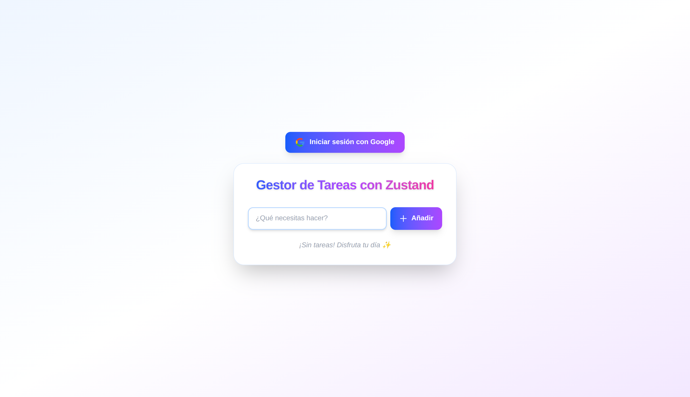

# 🦄 Gestor de Tareas con Zustand y Next.js

Este proyecto es un ejemplo moderno y minimalista de cómo usar Zustand para la gestión de estado global en una aplicación Next.js, con una interfaz atractiva y profesional gracias a TailwindCSS.

Repositorio: [https://github.com/adriangrahldev/nextjs-zustand-tasks](https://github.com/adriangrahldev/nextjs-zustand-tasks)

## 🚀 Características principales

- **Zustand** para manejo de estado global, simple y escalable.
- **Autenticación con Google** usando NextAuth.
- **UI/UX moderna**: diseño atractivo, responsivo y con animaciones.
- **Código limpio y comentado**: ideal para aprender y reutilizar.
- **Componentes desacoplados**: fácil de mantener y extender.

## 📸 Vistas previas

### Home (sin sesión iniciada)



### Home (usuario autenticado)


## 🛠️ Instalación y uso

1. Clona el repositorio:
   ```bash
   git clone https://github.com/adriangrahldev/nextjs-zustand-tasks.git
   cd nextjs-zustand-tasks
   ```
2. Instala las dependencias:
   ```bash
   npm install
   ```
3. Configura el cliente OAuth de Google:
   - Ve a [Google Cloud Console - Credenciales](https://console.cloud.google.com/apis/credentials)
   - Crea un nuevo **ID de cliente de OAuth 2.0** (tipo: aplicación web)
   - En **URIs de redirección autorizados** agrega:
     ```
     http://localhost:3000/api/auth/callback/google
     ```
   - Copia el **Client ID** y **Client Secret** generados
   - Crea un archivo `.env` en la raíz del proyecto y agrega:
     ```env
     GOOGLE_CLIENT_ID=tu_client_id
     GOOGLE_CLIENT_SECRET=tu_client_secret
     NEXTAUTH_SECRET=tu_secreto
     NEXTAUTH_URL=http://localhost:3000
     ```
4. Inicia el servidor de desarrollo:
   ```bash
   npm run dev
   ```
5. Abre [http://localhost:3000](http://localhost:3000) en tu navegador.

## 📂 Estructura relevante

```
/src
  /components
    AuthButton.tsx  # Componente para login/logout con Google
    TaskInput.tsx   # Componente para añadir tareas
    TaskList.tsx    # Componente para mostrar y gestionar tareas
  /stores
    useTaskStore.ts # Store Zustand para el estado global de tareas
  /app
    api/auth/[...nextauth]/route.ts # Configuración de NextAuth
    page.tsx        # Página principal con la UI
    layout.tsx      # Layout global con SessionProvider
```

## 🧑‍💻 ¿Por qué Zustand y NextAuth?
- Zustand: API simple y directa, sin boilerplate ni providers, escalable para proyectos reales.
- NextAuth: Autenticación robusta y fácil de integrar con múltiples proveedores.

## ✨ Créditos y recursos
- [Zustand](https://github.com/pmndrs/zustand)
- [Next.js](https://nextjs.org/)
- [NextAuth.js](https://next-auth.js.org/)
- [TailwindCSS](https://tailwindcss.com/)

---

¿Te resultó útil? ¡Dale una estrella al repo y compártelo! ⭐

---

> Hecho con pasión por **Adrian Grahl**  
> Desarrollador Full Stack, apasionado por crear soluciones y experiencias con enfoque en la satisfacción del usuario.  
> [LinkedIn](https://www.linkedin.com/in/adriangrahldev/)  
> 📧 adriangrahldev@gmail.com
