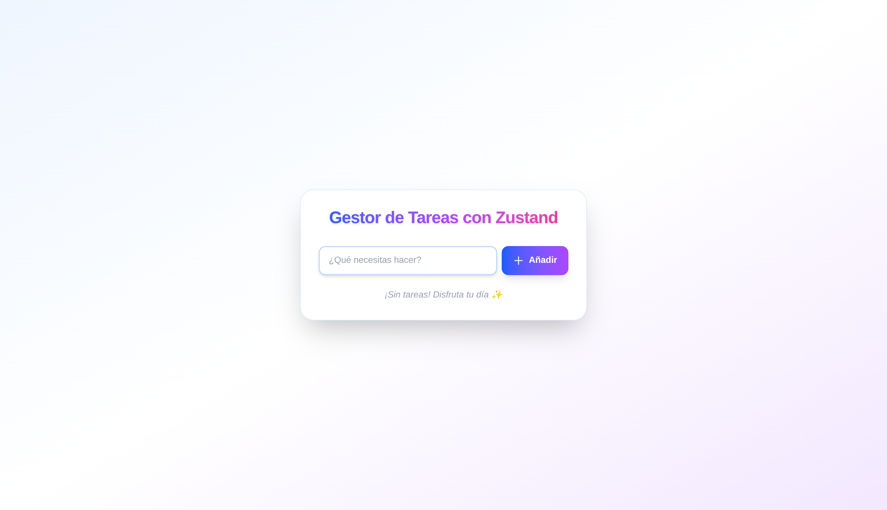

# 🦄 Gestor de Tareas con Zustand y Next.js

Este proyecto es un ejemplo moderno y minimalista de cómo usar Zustand para la gestión de estado global en una aplicación Next.js, con una interfaz atractiva y profesional gracias a TailwindCSS.

Repositorio: [https://github.com/adriangrahldev/nextjs-zustand-tasks](https://github.com/adriangrahldev/nextjs-zustand-tasks)

## 🚀 Características principales

- **Zustand** para manejo de estado global, simple y escalable.
- **UI/UX moderna**: diseño atractivo, responsivo y con animaciones.
- **Código limpio y comentado**: ideal para aprender y reutilizar.
- **Componentes desacoplados**: fácil de mantener y extender.

## 📸 Vista previa

> Puedes agregar aquí una captura de pantalla de la app:
>
> 

## 🛠️ Instalación y uso

1. Clona el repositorio:
   ```bash
   git clone https://github.com/adriangrahldev/nextjs-zustand-tasks.git
   cd nextjs-zustand-tasks
   ```
2. Instala las dependencias:
   ```bash
   npm install
   ```
3. Inicia el servidor de desarrollo:
   ```bash
   npm run dev
   ```
4. Abre [http://localhost:3000](http://localhost:3000) en tu navegador.

## 📂 Estructura relevante

```
/src
  /components
    TaskInput.tsx   # Componente para añadir tareas
    TaskList.tsx    # Componente para mostrar y gestionar tareas
  /stores
    useTaskStore.ts # Store Zustand para el estado global de tareas
  /app
    page.tsx        # Página principal con la UI
```

## 🧑‍💻 ¿Por qué Zustand?
- API simple y directa.
- Sin boilerplate ni providers.
- Escalable para proyectos reales.

## ✨ Créditos y recursos
- [Zustand](https://github.com/pmndrs/zustand)
- [Next.js](https://nextjs.org/)
- [TailwindCSS](https://tailwindcss.com/)

---

¿Te resultó útil? ¡Dale una estrella al repo y compártelo! ⭐

---

> Hecho con pasión por **Adrian Grahl**  
> Desarrollador Full Stack, apasionado por crear soluciones y experiencias con enfoque en la satisfacción del usuario.  
> [LinkedIn](https://www.linkedin.com/in/adriangrahldev/)  
> 📧 adriangrahldev@gmail.com
